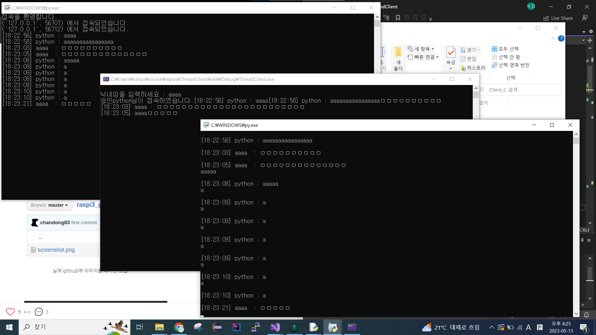

# 스레드 기반의 클라이언트
사용언어 : C 
통신 대상 언어 : Python
## 해결해야 하는 점
1. 메세지 정의
2. ~~공유 자원 문제 해결~~
	생각해보니 에코 서버가 아님
3. ~~읽기 스레드만 동작하는 문제~~
	반복문 수정으로 해결
4. ~~멀티 상황에서 테스트할 서버 부재 (만드는 중)~~
	만들어짐
5. recv는 반드시 한 번에 이루어진다는 보장이 없음
	파이썬은 잘 되는 것 같지만, c에서 recv()해서 buf에 내용을 저장해도 여러 번에 걸쳐 메세지가 도착하는 문제 발생, 추후 논의 필요
6. recv()로 받아오면 점차 문장이 짤려서 옴
	5번과 연관된 문제같음. recv 이후 buf에 저장된 데이터를 print해줄 때 printf("%s\n", buf);를 하면 지멋대로 끊어서 바이트를 가져와서 글도 ?로 일관되게 깨지고 난리도 아님
	+) 어느 시점부터 recv가 제대로 작동하지 않는 듯함.
	
	
