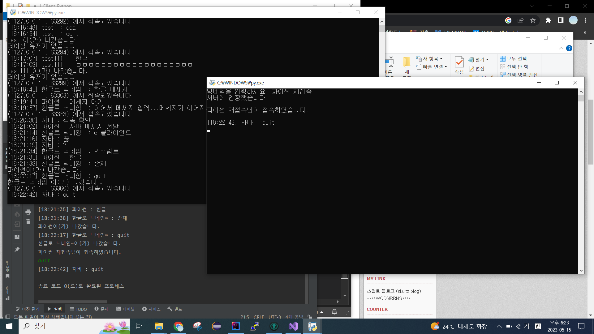

# 스레드 기반의 클라이언트
사용언어 : C<br>
통신 대상 언어 : Python
## 해결해야 하는 점
1. 메세지 정의
2. ~~공유 자원 문제 해결~~<br>
	생각해보니 에코 서버가 아님
3. ~~읽기 스레드만 동작하는 문제~~<br>
	반복문 수정으로 해결
4. ~~멀티 상황에서 테스트할 서버 부재 (만드는 중)~~<br>
	만들어짐
5. ~~recv는 반드시 한 번에 이루어진다는 보장이 없음~~<br>
	파이썬은 잘 되는 것 같지만, c에서 recv()해서 buf에 내용을 저장해도 여러 번에 걸쳐 메세지가 도착하는 문제 발생, 추후 논의 필요
6. ~~recv()로 받아오면 점차 문장이 짤려서 옴~~<br>
	5번과 연관된 문제같음. recv 이후 buf에 저장된 데이터를 print해줄 때 printf("%s\n", buf);를 하면 지멋대로 끊어서 바이트를 가져와서 글도 ?로 일관되게 깨지고 난리도 아님<br>
	+) 어느 시점부터 recv가 제대로 작동하지 않는 듯함.
7. ~~msg = '[{}] {} : {}'.format(time.strftime('%X'), user_list[sock][0], recvData.decode('euc-kr'))에서 recvData.decode('euc-kr')만 못받음~~<br>
	클라이언트에서 닉네임 설정할 때 문자열 끝을 알리기 위해 삽입한 \0 때문이었음.<br>
	c는 \0로 문자열의 끝을 판단하고 그 뒤의 내용은 print하지 않기 때문에 빈 공백으로 처리하고 넘어가는 python이나 null 문자로 처리하고 넘어가는 java랑 다르게 메세지가 끝까지 출력이 안 됐던 것<br>
	일단, 닉네임을 전달할 때 \n나 \0가 끝에 없으면 오류가 나기 때문에 recv()하고 buf에서 닉네임 끝의 \0을 따로 지워서 출력함
	따라서, 서버나 c제외 클라이언트에게는 [시간대] 닉네임\0 : 메세지의 형태로 아직 존재.<br>
	 
8. 해당 부분에서 입력 버퍼가 완전히 비워지지 않아 setName()함수가 무한 루프에 빠지는 문제
	```c
	strcat_s(check, checklen, ACCEPT);
	scanf_s("%c", &frashBuffer); //해당 부근에서 입력버퍼에 남은 데이터가 존재하는 걸로 추정, 트래쉬 데이터를 버리는 방식을 채택
	strcat_s(check, checklen, name);
	```
	버퍼를 버리는 것으로 임시 조치 해둠
9. quit 입력 이후 quit이라는 메세지가 다른 클라이언트에게 전달됨.
10. quit 입력 이후 서버로부터 quit이라 쳤던 것을 일부 recv()를 받는 것으로 보임<br>
	아래 캡처에서는 테스트로 사용된 java 클라이언트와 python 클라이언트의 화면이 존재. 
	
